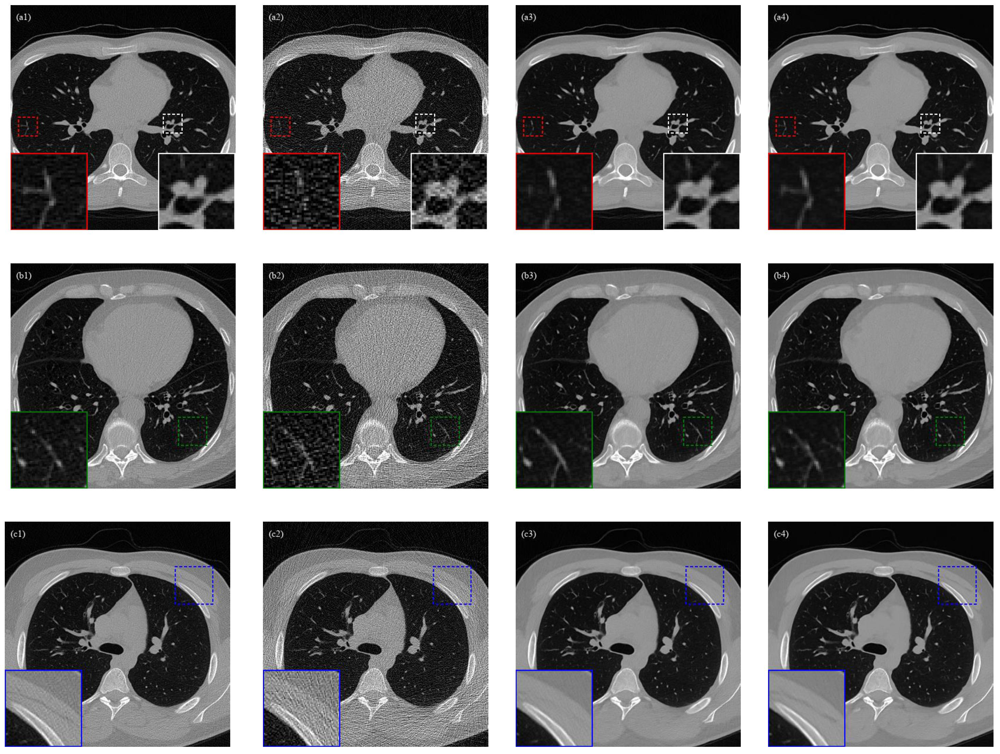

# 3D U-NetR: Low Dose CT Reconstruction
This is the official repository for __"3D U-NetR: Low Dose Computed Tomography Reconstruction via Deep Learning and 3 Dimensional Convolutions"__.

The paper is online at: [[here]](https://arxiv.org/abs/2105.14130)

## Installation
The required Python libraries should be installed.

```
pip install -r requirements.txt
```

## Demo
Example real chest CT results from paper.



Each row denoted as (a), (b), and (c) indicates a different real chest CT image. Columns (1-4) represent ground truth, FBP, 2D U-Net, and 3D U-NetR outputs, respectively.

## Reference

```
@article{gunduzalp20213d,
  title={3D U-NetR: Low Dose Computed Tomography Reconstruction via Deep Learning and 3 Dimensional Convolutions},
  author={Gunduzalp, Doga and Cengiz, Batuhan and Unal, Mehmet Ozan and Yildirim, Isa},
  journal={arXiv preprint arXiv:2105.14130},
  year={2021}
}
```
